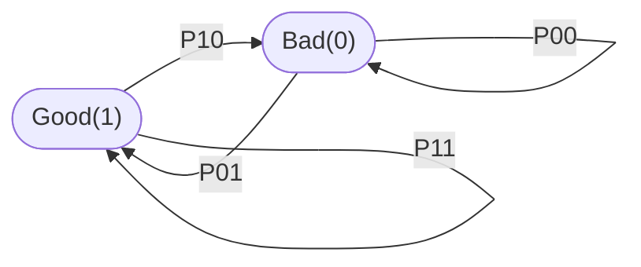
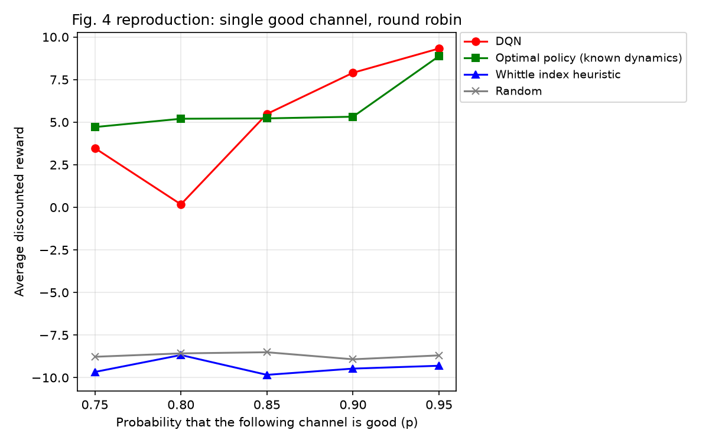
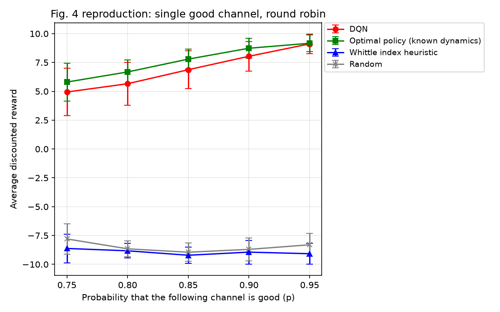
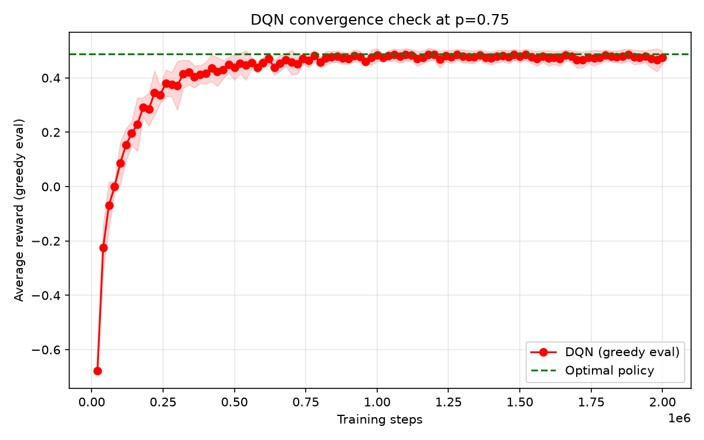
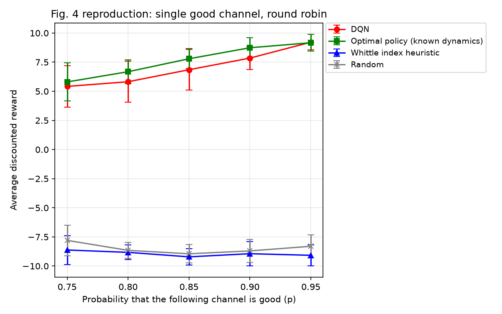

# Deep Reinforcement Learning for Dynamic Multichannel Access

A from-scratch replication of Wang, Liu, Gomes & Krishnamachari, __*"Deep Reinforcement Learning for Dynamic Multichannel Access in Wireless Networks"*__ (arXiv:[1802.06958](https://arxiv.org/abs/1802.06958)). [](https://doi.org/10.1109/TCCN.2018.2809722)

## Motivation

Dynamic spectrum access is one of the core problems in cognitive radio. The standard approach in the literature assumes channels switch independently, but in real deployments (WSNs on 2.4 GHz, for example) channels are correlated: external interference from Wi-Fi, Bluetooth, and microwave ovens affects multiple channels at once. When channels are correlated, the joint system state lives in a space of $2^N$ configurations and is only partially observable, so classic MDP solutions fail.
[Wang et al.](https://arxiv.org/abs/1802.06958) show that a Deep Q-Network can learn a near-optimal channel access policy in this setting *without* knowing the transition probabilities a-priori. This repository reproduces that result end-to-end, verifies it against the paper's analytical optimal policy (*Theorem 1*).

## Problem Setup

A single secondary user shares spectrum with primary users across $N=16$ channels (fixed in the paper's experiments, not treated as a free parameter). This is a single-agent problem with one learning agent, one channel choice per time step. Multi-user variants are discussed by
the authors as future work and are not implemented here.

Each channel is a two-state (good/bad) process. Unlike the classical Gilbert-Elliot model, channels are **correlated** with each other rather than switching independently, so the joint system state lives in a space of $2^N$ configurations ([Section III](https://arxiv.org/abs/1802.06958)).


*Per-channel marginal view.* Each channel is good or bad at each time slot. In the round-robin case these are **not** independent: the system has exactly one good channel, which holds its position with probability $(1−p)$ or advances by one slot with probability $p$. The two-state diagram above describes how an individual channel's marginal state evolves, not the joint dynamics.

At each time step the agent picks exactly one channel, observes only whether *that* channel was good or bad, and gets $+1$ (success i.e picked good channel) or $-1$ (transmission failure i.e picked a bad channel). It never observes the other $N-1$ channels and never has access to the transition probabilities. That makes this a POMDP as the true joint state is never fully observed.

**Section VII-B (this repo's case): single good channel, round-robin switching**.

If channel $k$ is good at time $t$, it stays good with probability $(1-p)$, or the next channel $(k+1)$ in sequence becomes good instead with probability *p*. This is the simplest case of the paper's "fixed-pattern" switching (Section VI), where channels are grouped into subsets activated in a fixed sequence.

**Section VI (optimal-policy baseline):** 

With probability $p$, the switching order, and the initial subset known a-priori, the optimal policy (Theorem 1) is a simple threshold rule where if $p \geq 0.5$, stay on the current channel after a bad observation and advance after a good one, else if $p \lt 0.5$, the rule flips. This is the ground-truth upper bound to check the DQN against.

**Section VII-A (state encoding):** 

The DQN's input state is the past M=N per-slot observation vectors concatenated together, each a length-N vector with $+1$ at the selected channel if good, $-1$ if bad, and $0$ everywhere else.

## Methods Implemented

| Method | Description | Requires known dynamics? |
|---|---|---|
| Optimal policy (Theorem 1) | Closed-form policy for fixed-pattern switching | Yes |
| Whittle Index heuristic | MLE-estimated per-channel transition matrix + index policy | No (estimates it) |
| DQN | $2 \times 200$ ReLU hidden layers, $\epsilon$-greedy ($\epsilon=0.1$), experience replay, Adam | No |

## Architecture

- State: past $M=N=16$ actions + observations (input dim $= 16 \times 16 = 256$)

## Methodology Notes

Four non-obvious issues surfaced during replication and materially affect the Fig. 4 numbers. They are recorded here because they would not be obvious from a casual read of the paper.

1. **Discounted return's effective horizon.** With $\gamma$=0.9, the sum of $\gamma^t$ over $t=0..29$ is $9.58$ out of the $\sim 10$ effective horizon which is approximately $95\\%$ of the discounted return comes from the first $30$ steps of a trajectory. Naive per-episode evaluation therefore measures cold-start transient rather than steady-state policy quality. We run `BURN_IN=200` steps unscored before accumulating discounted reward over `SCORE_STEPS=1000`.

2. **Genie initialization for Theorem 1.** The optimal policy requires knowing the initial active channel ([Section VI](https://arxiv.org/pdf/1802.06958)). An earlier version of the evaluation initialized the policy to a fixed channel regardless of the environment's true initial state, which broke the policy's invariant. After its first bad observation, the policy would stay on a channel that was not the true good one. The final evaluation syncs the policy to the environment's true initial channel, matching *Theorem 1*'s stated assumption.

3. **Equal evaluation protocol across policies.** DQN is averaged over $3$ training seeds $\times 10$ eval trajectories ($30$ samples); Optimal, Whittle, and Random are each averaged over $10$ eval trajectories. Earlier the DQN was reported with error bars but baselines were reported as single samples which produced misleading "DQN beats Optimal" readings.

4. **Per-p training schedule.** The paper does not report how long the DQN was trained. Our first sweep used $200k$ steps per $p$ and plateaued at $\sim 85\\%$ of the optimal policy's reward at low $p$. A per-p convergence diagnostic (`experiments/check_convergence.py`) showed the DQN needs roughly an order of magnitude more training at low $p$ to converge: $~2M$ steps at $p=0.75$, $~500k–1.5M$ at mid $p$, and ~500k at $p \geq 0.90$. The schedule used for the final Fig. 4 sweep is:

|$p$|training steps|
|---|---|
|$0.75$|$2,100,000$|
|$0.80$|$2,000,000$|
|$0.85$|$1,800,000$|
|$0.90$|$1,500,000$|
|$0.95$|$600,000$|

## Results

### Round-robin switching (reproduces Fig. 4)

The paper does not report how long the DQN was trained, and training duration turned out to be the dominant factor in reproducing Fig. 4. Three successive sweeps tell the story:

#### Attempt 1: 200k steps
When the DQN was underperforming due to smaller training steps and episodes.



#### Attempt 2: 400k steps 
After increasing training steps to 400k steps, partial improvement was obtained, but the gap at low $p$ persists so more steps per $p$ were still needed.



DQN tracks the shape of the Optimal policy across $p$, but does not fully close the gap, and the size of that gap shrinks as $p$ increases. Results (mean $\pm$ std, discounted return over $10$ eval trajectories $\times 3$ training seeds):

| p | DQN | Optimal | Whittle Index | Random |
|---|---|---|---|---|
| 0.75 | $+4.940 \pm 2.053$ | $+5.803 \pm 1.632$ | $-8.623 \pm 1.237$ | $-7.797 \pm 1.307$ |
| 0.80 | $+5.659 \pm 1.861$ | $+6.680 \pm 1.032$ | $-8.826 \pm 0.628$ | $-8.653 \pm 0.687$ |
| 0.85 | $+6.872 \pm 1.639$ | $+7.792 \pm 0.858$ | $-9.211 \pm 0.717$ | $-8.948 \pm 0.800$ |
| 0.90 | $+8.039 \pm 1.279$ | $+8.735 \pm 0.867$ | $-8.941 \pm 1.027$ | $-8.701 \pm 0.977$ |
| 0.95 | $+9.111 \pm 0.845$ | $+9.168 \pm 0.711$ | $-9.078 \pm 0.892$ | $-8.304 \pm 0.980$ |

At the completed $p$ values, DQN reaches $85\\%$ of Optimal's discounted return at $p=0.75$, rising to $99.37\\%$ at $p=0.95$. The gap narrows as $p$ increases. The paper reports that DQN achieves the same optimal performance as the optimal policy across all $p$, the residual gap in this replication is its central discrepancy.

#### Diagnosis: convergence and policy extraction.

**Convergence**



At $p=0.75$, DQN converges to within $\sim 2\\%$ of the optimal policy's reward (dashed line, +0.487 per step) only after roughly $2M$ steps. Earlier checkpoints in the same run show the policy still improving well past the 200k step count used in the initial Fig. 4 sweep which confirms that the initial gap was under-training, not a policy failure.

**Policy Extraction**

`policies/analyze_policy.py` loads the converged $p=0.75$ checkpoint and compares its greedy actions against Theorem 1's rule:

|Metric|Learned DQN|Theorem 1|
|---|---|---|
|Fraction on true good channel|	$0.761$|	$0.75$|
|Advance after $+1$|	$1.000$	|$1.000$|
|Stay after $-1$|	$0.991$	|$1.000$|
|Failures that were policy-correct (unavoidable)	|$0.991$	|$1.000$|
|Failures that were policy errors|	$0.009$	|$0.000$|
|Overall failure rate|	$0.239$	|$0.25$|

The learned policy reproduces Algorithm 1 exactly at the level of its action rule. It advances after every successful transmission and stays after every failed one (with a $0.9\\%$ residual error rate consistent with the tail of the Q-function's resolution at low $p$). The overall failure rate ($23.9\\%$) matches the theoretical $25\\%$ to within sampling error.

#### Attempt 3: per-$p$ training schedule 
Re-running the sweep with the per-$p$ schedule from `Methodology note 4` produces the paper-like result below.



| $p$ | DQN | Optimal  | Whittle Index | Random |
|---|---|---|---|---|
| 0.75 | $+5.418 \pm 1.769$ | $+5.803 \pm 1.632$ | $-8.623 \pm 1.237$ | $-7.797 \pm 1.307$ |
| 0.80 | $+5.820 \pm 1.753$ | $+6.680 \pm 1.032$ | $-8.826 \pm 0.628$ | $-8.653 \pm 0.687$ |
| 0.85 | $+6.852 \pm 1.737$ | $+7.792 \pm 0.858$| $-9.211 \pm 0.717$ | $-8.948 \pm 0.800$ |
| 0.90 | $+7.848 \pm 0.971$ | $+8.735 \pm 0.867$| $-8.941 \pm 1.027$ | $-8.701 \pm 0.977$ |
| 0.95 | $+9.214 \pm 0.670$ | $+9.168 \pm 0.711$ | $-9.078 \pm 0.892$ | $-8.304 \pm 0.980$ |

DQN matches the optimal policy within statistical noise at both endpoints ($p=0.75$: gap $0.385$, $p=0.95$: DQN nominally *above* optimal by $0.046$, again within noise). A small residual gap of $\sim 0.9$ return units ($10-12\\%$) remains at mid $p$ ($0.80–0.90$, $\approx 2–3 \sigma$) and is the largest remaining quantitative deviation from the paper's claim that DQN matches optimal at every $p$. The convergence diagnostic and policy extraction above both attribute this to finite training rather than a policy failure.

Whittle Index sits close to Random across all $p$, and both sit far below DQN and Optimal. This is consistent with the paper's discussion of why an independent-channel heuristic cannot exploit the round-robin correlation.

## Running

```bash
pip install -r requirements.txt

# Sanity check on each component
python -m policies.optimal_policy       # validates Theorem 1 against 2p-1
python -m policies.whittle_index        # validates Whittle against random

# Convergence diagnostic
python -m experiments.check_convergence --p 0.75 --steps 2000000

# Policy extraction on a trained checkpoint.
python -m policies.analyze_policy

# Main Fig. 4 sweep
python -m experiments.exp1_round_robin
```

## References

- Wang, S., Liu, H., Gomes, P. H., & Krishnamachari, B. (2018). Deep reinforcement learning for dynamic multichannel access in Wireless Networks. IEEE Transactions on Cognitive Communications and Networking, 4(2), 257–265. https://doi.org/10.1109/tccn.2018.2809722 Also in (arXiv:[1802.06958](https://arxiv.org/abs/1802.06958)) 
